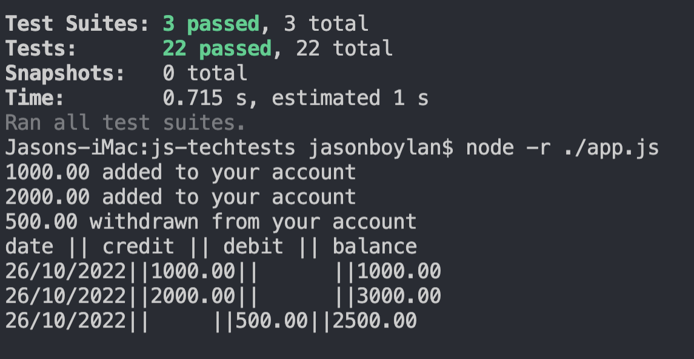

**before you get started, you will need to install some dependencies**

run:

npm install

now you can use *node.js* to run the *app.js* file by typing in terminal:

node -r ./app.js

This is a simple example of the file working on a few pre-written examples

you can use the program itself by running:

node
const User = require('./User');
const Account = require('./Account')

**here you can utilise the software itself with a test account by running:**

let testAccount = new Account;
let testUser = new User;

**from here your functions are:**

*user*
.addAccount(account) 
takes an account object as a parameter
.getStatement()
formats a statement utilising all of your added accounts

*account*
.getBalance() 
takes no parameters and logs a statement
.addBalance(number)
argument is a number, adds money to your account
.withdrawBalance(number)
argument is a number, withdraws money from your account

example of code working:

code created by Vanboylan, available at www.github.com/vanboylan
